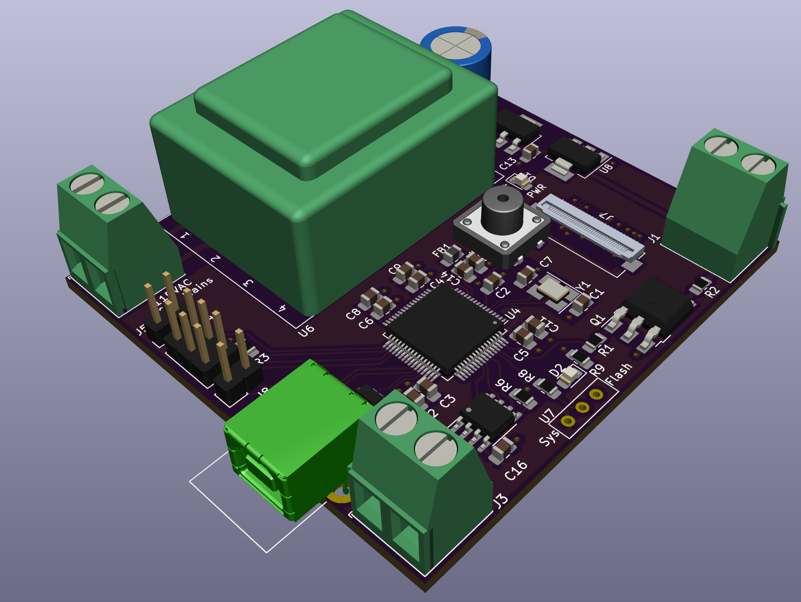

# Solder Reflow Oven

 
<h1> What is it ? </h1>
A homebrew solder reflow oven controller designed around an STM32L053 series MCU with PCB layouting done in Kicad. A solder reflow oven is a device used to 
automatically solder SMD components. When dealing with integrated circuits designed to operate at high frequencies, their packages might not have leads solderable by
hand (leads can add unwanted inductance). Therefore, the only way to solder them is by using a solder reflow oven.  
 

<h1> How does it work ? </h1>

1. The pads of the PCB are covered in solder paste, typically done with the help of a stencil

2. The components are then carefully placed on the board, the paste helps in providing adhesion to hold the components in place
 
3. The board is then placed inside the oven which controls the ambient temperature to follow a certain profile (specific to the solder paste used)
 
4. During this process the components get soldered onto the board

<h1> Heart of the Solder Reflow Oven </h1>
The heart of the solder reflow oven is the controller (the design included in this repo) which controls the ambient temperature inside the oven to follow the
specified profile. I use PID (Proportional Integrator Differentiator) control to control the ambient temperature.  
